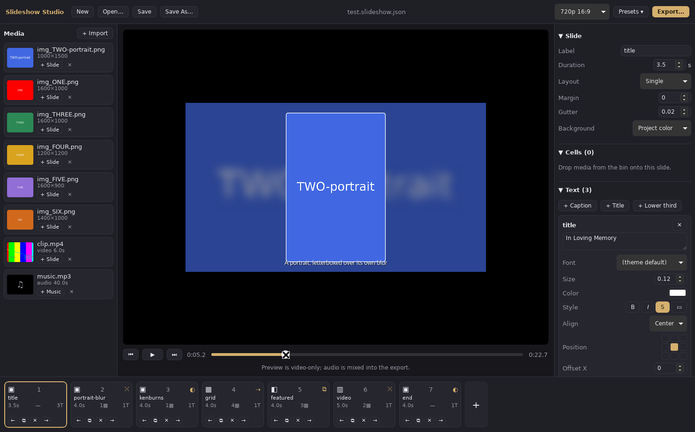
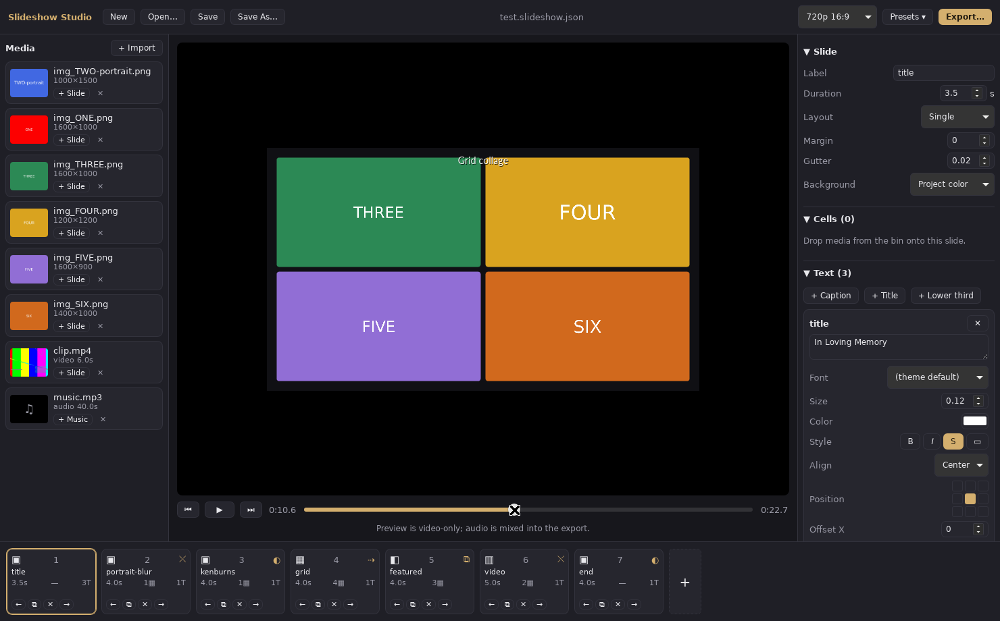
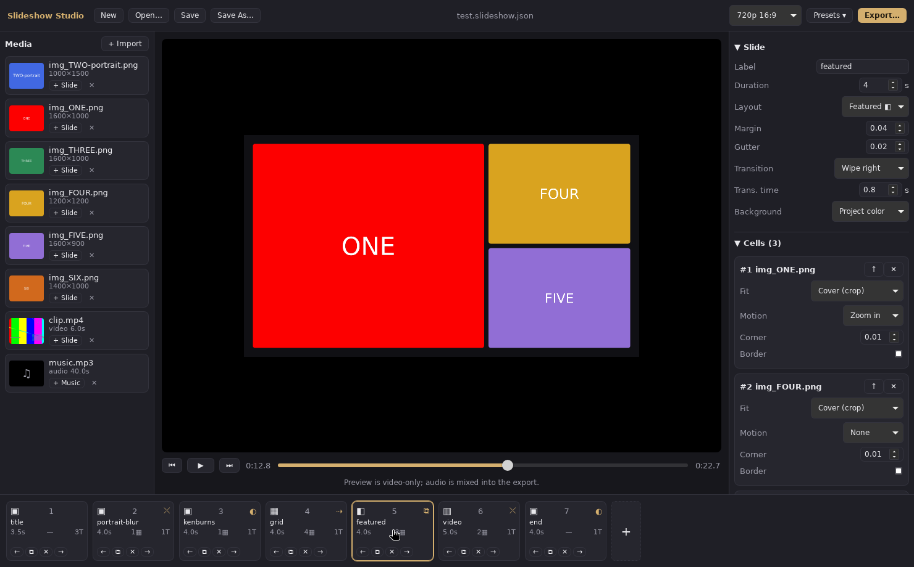
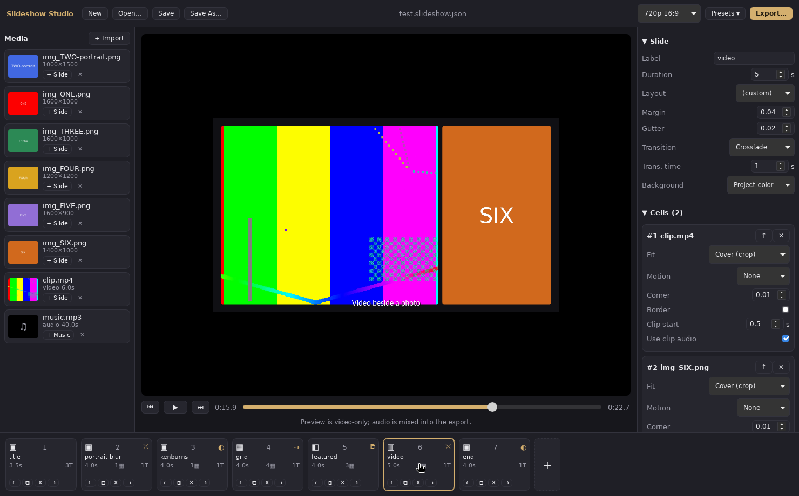
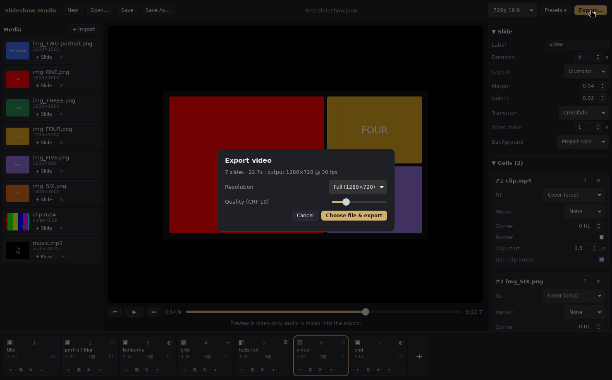

# Slideshow Studio

A **focused slideshow-video maker** — not a video editor. Point it at photos,
video clips and music; get back a rendered MP4 with collage layouts, gentle
Ken Burns motion, titles/captions and transitions. Built for memorial &
tribute videos, useful for any slideshow.

- **Native desktop app** (macOS + Windows): Tauri shell, React UI, all
  rendering in Rust.
- **Headless CLI** (`slideshow`): render the same project files from a
  terminal or CI.
- **One compositor for preview and export** — what you scrub in the app is
  pixel-for-pixel what ffmpeg encodes.

## Screenshots

| | |
|---|---|
|  |  |
|  |  |
|  |  |

## Layout

```
crates/slideshow-core   engine: project model, timeline, layouts, compositor,
                        text, media decode, audio mix, MP4 export
crates/slideshow-cli    headless CLI (bin: slideshow)
app/                    Tauri v2 app (React + TypeScript frontend)
scripts/                fetch-ffmpeg.sh / fetch-ffmpeg.ps1
examples/               test project + media generator
assets/fonts/           bundled OFL fonts (Crimson Text, Lato)
```

## Prerequisites

- Rust (stable), Node 20+
- **ffmpeg + ffprobe** — the engine decodes video and encodes MP4s through
  ffmpeg. Either have them on your PATH (`brew install ffmpeg`,
  `winget install ffmpeg`) or fetch static sidecar builds:

```sh
scripts/fetch-ffmpeg.sh        # macOS / Linux
scripts\fetch-ffmpeg.ps1       # Windows (PowerShell)
```

The app looks for ffmpeg next to the executable, then in `binaries/`, then on
PATH (`SLIDESHOW_FFMPEG_DIR` overrides). Bundled ffmpeg builds are
GPL-licensed — keep their attribution if you distribute the app.

## Run the app

```sh
cd app
npm install
npm run tauri dev      # dev app
npm run tauri build    # installers (requires the sidecar fetch above)
```

## CLI

```sh
cargo run --release -p slideshow-cli -- new myshow          # scaffold a project
cargo run --release -p slideshow-cli -- info project.slideshow.json
cargo run --release -p slideshow-cli -- frame project.slideshow.json -t 3.2 -o frame.png
cargo run --release -p slideshow-cli -- render project.slideshow.json -o out.mp4
```

Try the full-feature example:

```sh
examples/make-test-media.sh
cargo run --release -p slideshow-cli -- render examples/test.slideshow.json -o examples/out/test.mp4
```

## Project files

Projects are versioned JSON (`*.slideshow.json`) — friendly to hand-editing
and version control. Media paths may be relative to the project file. The
main knobs:

- **Slides**: duration, layout (`single`, `rows`, `columns`, `grid`,
  `featured`, `custom` rects), margin/gutter, background (color or a blurred
  cover of one of the slide's own photos).
- **Cells** (one per photo/clip in the collage): `cover`/`contain` fit,
  motion (`zoom` in/out or full `ken_burns` from→to crop windows), corner
  radius, border. Video cells can seek (`start`) and contribute their own
  audio (`mute: false`).
- **Text overlays**: roles (title/subtitle/caption/lower_third/credit) with
  sensible fonts, size/color/align, 9-point anchor + offset, wrap width,
  shadow, backing box, timed appearance with fades.
- **Transitions** into each slide: cut, crossfade, fade through black/white,
  slide, wipe (any direction), with per-slide duration.
- **Audio tracks**: placement, seek offset, gain, fade in/out, looping to
  fill the video. Everything is mixed with the video-clip audio and clamped
  to the timeline.

Sizes/offsets are fractions of the frame, so the same project renders
correctly at 720p, 1080p, 4K, vertical or square output.

## Out of scope (v1)

Per-word karaoke text, beat-sync, GPU compositing, real-time full-res audio
playback in preview, nested timelines. The preview plays video only; audio is
heard in the exported file.

## Fonts

Bundled fallback fonts: Crimson Text (serif — titles) and Lato (sans —
captions), both under the SIL Open Font License (see `assets/fonts/`).
System-installed fonts are also available in the app's font picker.
