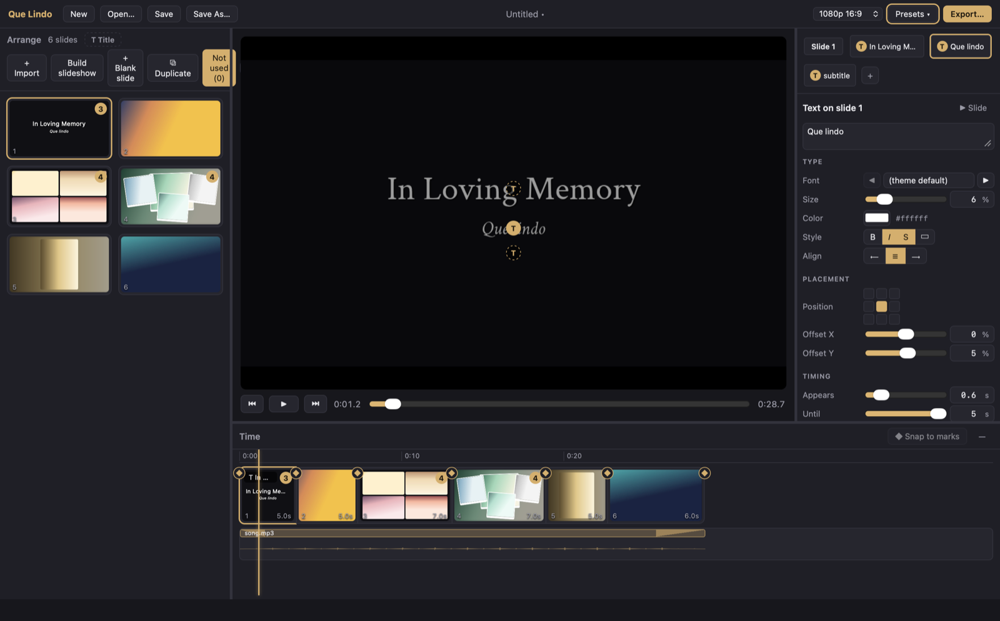
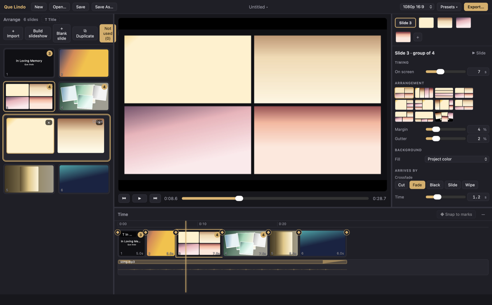
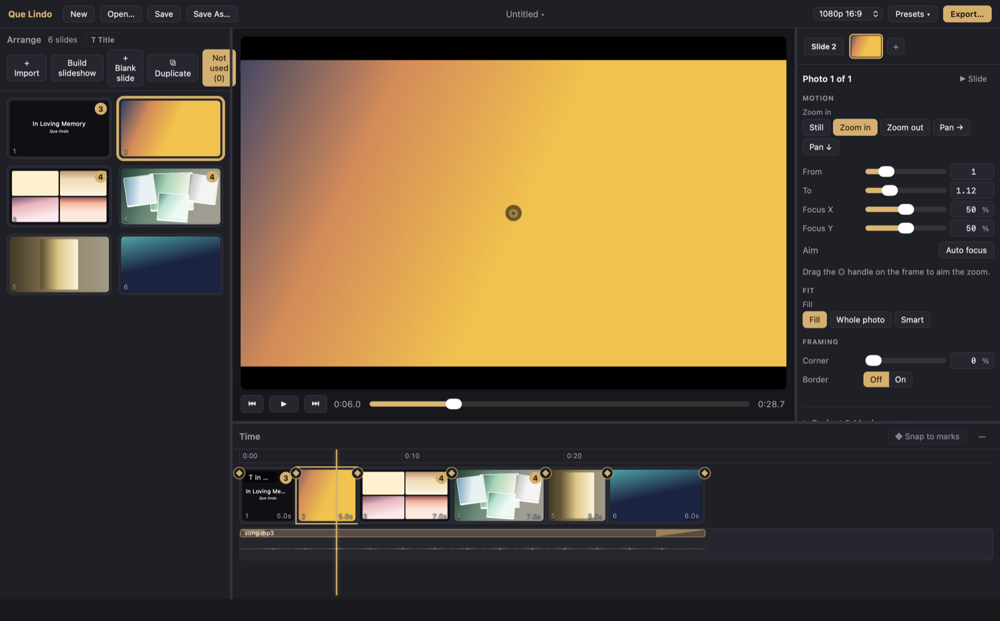
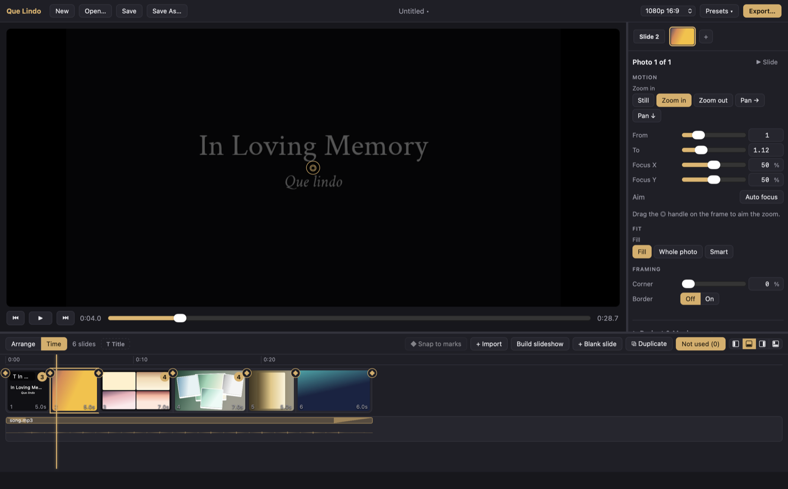
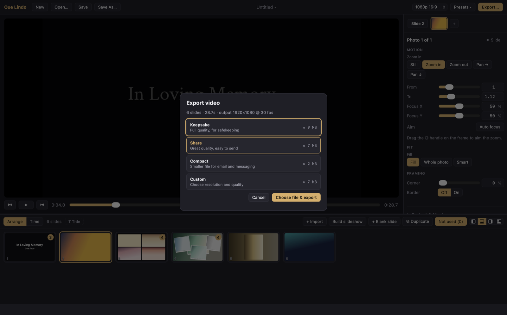

# Que Lindo

A small, local slideshow-video maker. Drop in photos, clips and music; get an
MP4 with collage layouts, gentle Ken Burns motion, titles and transitions.
No account, no upload, no timeline editor to learn.

*Que lindo* is Spanish for "how lovely", something my Abuela used to say all
the time, and it still makes me think of her. I built this to make the video
for her memorial, after finding that every option was either a cloud service
that owned the result or a full video editor that was far more tool than the
job needed. This project is named for her.

> **Status:** 0.1.0. Developed and used on macOS. Windows builds in CI but has
> had far less use. There are no releases yet; build from source (below).

## Screenshots

| | |
|---|---|
|  |  |
|  |  |
|  | |

## What it does

### From a pile of photos to a draft in one click

**Auto-build** takes everything on the shelf and assembles a film you adjust
rather than build:

- **Moments, not files.** Photos taken together become one collage. Grouping
  runs in Rust as order-independent correlation clustering (average-linkage
  agglomeration with a local-search pass), so a shuffled import builds the
  same film. The pairwise signal combines:
  - capture time from EXIF, with a 90-second window when both photos are dated;
  - a 6×6 mean-colour fingerprint, cheap and always available;
  - a scene embedding from a CLIP vision model, which recognises the same
    moment shot from different angles or rooms (optional model, see below);
  - face identity embeddings, a bounded bonus that can tip a pair whose
    scenes are already close but never joins strangers on its own;
  - the detector's face count, which widens or narrows how far the colour
    fingerprint is trusted: matching counts loosen it, a portrait against a
    crowd tightens it.
- **Oldest first.** Moments are ordered by real capture date when they have
  one, otherwise by *apparent* age: a linear probe trained on the Date
  Estimation in the Wild dataset reads the scene embedding as a year (held-out
  error about nine years, 1930–1999), with a modern-photo gate so undated
  phone shots sort after the prints.
- **Pacing chosen for you.** Single photos hold for 5 s, collages for 7 s,
  clips run 2–8 s, transitions are gentle crossfades, and every eighth slide
  arrives out of black as a breath. Consecutive collages cycle through a
  composed layout, a face-dealt scatter pile and a mosaic, so a long run of
  moments never repeats one look.

### Faces steer the framing

A bundled, offline face detector (SeetaFace via `rustface`) runs on import.

- **Zoom aims at faces.** The default Ken Burns motion for a photo zooms
  toward the detected faces instead of the centre.
- **Smart fit.** A cell can fill its frame with the crop pulled toward the
  faces rather than a centred crop, so nobody loses their head in a 16:9
  frame. Auto-build picks Smart fit whenever faces were found; you can move
  the aim point by hand in the preview.

### Layouts and motion

- Collage layouts for one to eight members: single, rows, columns, grid,
  featured, plus a catalog of presets over the engine's custom rectangles
  (inset, tower, band, pinwheel, hero row, quilt, hero quilt, scatter with
  per-print rotation and paper frames).
- Backgrounds: a project colour, a slide colour, or a blurred, dimmed cover
  of one of the slide's own photos.
- Motion per cell: still, zoom in or out toward a focus point, or a full Ken
  Burns crop-to-crop move. Corner radius and borders per cell.
- Sizes and offsets are fractions of the frame, so one project renders at
  720p, 1080p, 4K, vertical 9:16 or square 1:1 without re-editing.

### Titles and captions

- Roles with sensible defaults: title, subtitle, caption, lower third,
  credit. Ready-made title and end cards, and a "memorial pacing" preset
  that lengthens slides, softens every transition and eases the music in
  and out.
- Any system font or the bundled Crimson Text and Lato. Requested weights
  snap to what the family actually has, so a font never silently falls
  back to the system face. Shaped and wrapped by `cosmic-text`, including
  right-to-left scripts.
- Nine-point anchoring with offsets, wrap width, shadows, backing boxes,
  timed appearance with fade in and out. Text can be dragged in the preview.
- Titles are members of a slide: drag the T chip onto a photo and the title
  lives with that photo, splits out into its own card, and rides along when
  cards are regrouped.

### Music and clips

- Several tracks with placement, trim, gain, fades and looping to fill the
  film. A second song chains after the first with a 3 s crossfade; only the
  last one loops. Video clips can contribute their own audio.
- **Beat marks.** Tap marks on the music while it plays; a nudge walks
  nearby slide boundaries onto the beats within bounded stretch, so the cut
  lands on the downbeat without anything jumping.
- The preview plays the same mix the export muxes, rendered by one ffmpeg
  filter graph, and the Time view draws its waveform under the cards.

### Editing

- **Arrange** is a grid of moments: drag to reorder, drop a card on another
  to bind them, ↵ opens a group as a band you can rearrange or split,
  rubber-band and ⌘/⇧ selection, context menus, a "Not used" shelf that
  holds anything you hide. **Time** stretches the same cards to their
  durations with a ruler, seam markers and the audio lane. Dock either to
  the bottom, left or right, or split to see both.
- **Edit in an external app** (macOS): send a photo to Photos, Preview or
  any registered editor; when it comes back changed the thumbnail and
  preview refresh.
- Preview and export share one Rust compositor, so what you scrub is what
  ffmpeg encodes. Frames come back over binary IPC and are cached.
- Undo and redo for everything, autosave every 30 s with crash recovery on
  next launch, and a relink dialog for media that moved on disk.

### Export

MP4 with H.264: hardware VideoToolbox on macOS when available, otherwise
libx264 with a quality (CRF) and speed preset. Transitions: cut, crossfade,
fade through black or white, slide and wipe in any direction, each with its
own duration, plus an outro fade.

### Formats

Photos: JPEG, PNG, GIF, WebP, BMP, TIFF, with EXIF orientation honoured.
Video: MP4, MOV, M4V, MKV, AVI, WebM. Audio: MP3, M4A, AAC, WAV, FLAC, OGG.
Anything ffmpeg can decode works as a clip.

Everything runs on your machine. There is no telemetry.

## Building from source

Prerequisites: Rust (stable), Node 20+, and **ffmpeg + ffprobe**.

ffmpeg is used for decoding video and encoding the MP4. Either install it
(`brew install ffmpeg`, `winget install ffmpeg`) or fetch static builds that
Tauri bundles as sidecars:

```sh
scripts/fetch-ffmpeg.sh        # macOS / Linux
scripts\fetch-ffmpeg.ps1       # Windows (PowerShell)
```

The Tauri build needs the sidecars present even for `dev`; without them it
fails with `resource path binaries/ffmpeg-<triple> doesn't exist`. At runtime
the engine looks next to the executable, then in `binaries/`, then on PATH.
`SLIDESHOW_FFMPEG_DIR` overrides all three.

The first build also downloads ONNX Runtime (via the `ort` crate), so it
needs network access once.

```sh
cd app
npm install
npm run tauri dev      # run the app
npm run tauri build    # installers in target/release/bundle/
```

### Optional models

Auto-build works out of the box using capture dates, colour fingerprints and
a bundled face detector. Two optional ONNX models make it much better at
recognising the same moment across angles and rooms, and enable ordering by
apparent era:

| File | Purpose |
|---|---|
| `clip-vision-b32-int8.onnx` | Scene embeddings (CLIP ViT-B/32, int8) |
| `facenet-vggface2.onnx` | Face identity embeddings |

Place them in `<app data>/models/`, which on macOS is
`~/Library/Application Support/com.jarektoro.quelindo/models/`.
`SLIDESHOW_EMBED_MODEL` points at the CLIP model directly. The app gates the
related features off when the files are absent.

## Command line

The same engine ships as a headless CLI, `slideshow`, for scripting and CI:

```sh
cargo run --release -p slideshow-cli -- new myshow                          # scaffold a project
cargo run --release -p slideshow-cli -- info project.slideshow.json          # duration and per-slide timing
cargo run --release -p slideshow-cli -- probe photo.jpg                      # media metadata as JSON
cargo run --release -p slideshow-cli -- frame project.slideshow.json -t 3.2 -o frame.png
cargo run --release -p slideshow-cli -- render project.slideshow.json -o out.mp4
```

`render` takes `--scale`, `--crf`, `--preset` and `--encoder` (software x264
or VideoToolbox on macOS). Try the full-feature example:

```sh
examples/make-test-media.sh
cargo run --release -p slideshow-cli -- render examples/test.slideshow.json -o examples/out/test.mp4
```

## Project files

A project is JSON with `settings` (size, fps, background), `slides`, and
`audio` tracks. The main knobs:

- **Slides**: duration, layout (`single`, `rows`, `columns`, `grid`,
  `featured`, `custom` rects), margin/gutter, background (colour or a blurred
  cover of one of the slide's own photos), transition into the slide.
- **Cells** (one per photo or clip): `cover`/`contain` fit, motion (`zoom` or
  `ken_burns` from/to crop windows), corner radius, border. Video cells can
  seek (`start`) and contribute audio (`mute: false`).
- **Text overlays**: role, font, weight, size, colour, align, anchor and
  offset, wrap width, shadow, backing box, `start`/`end` with fades.
- **Audio tracks**: placement, seek offset, gain, fade in/out, loop to fill.

See [examples/test.slideshow.json](examples/test.slideshow.json) for every
feature in one file.

## Scanning old prints

[tools/autocrop](tools/autocrop) is a companion for the step before the
slideshow: photographs of printed photos laid on a plain background.
`autocrop.py` finds each print, straightens it and crops it at full
resolution. `review.py` opens the same detection in a browser so you can nudge
the corners before committing. Both are single-file Python scripts with inline
dependencies (`uv run tools/autocrop/review.py scans/`).

## Development

```
crates/slideshow-core   engine: project model, timeline, layouts, compositor,
                        text, media decode, audio mix, moment grouping, export
crates/slideshow-cli    headless CLI (bin: slideshow)
app/                    Tauri v2 app (React + TypeScript), face detection,
                        embeddings, preview server
app/e2e/                WebdriverIO end-to-end suites against the real app
                        (tools/screenshots.spec.ts regenerates the README shots)
examples/               full-feature project + placeholder media generator
scripts/                ffmpeg sidecar fetchers
tools/autocrop          print scanning helper
assets/fonts/           bundled OFL fonts (Crimson Text, Lato)
docs/                   screenshots and the editor-shell schematic
```

```sh
cargo test -p slideshow-core -p slideshow-cli   # engine unit tests
cd app && npx tsc --noEmit                      # frontend typecheck
cd app && npm run e2e:build && npm run e2e     # end-to-end suites (see app/e2e/README.md)
cd app && npm run dev:mcp                       # app with the MCP debug bridge for agents
```

End-to-end tests use WebdriverIO with `@wdio/tauri-service`, the setup Tauri
documents, against a debug build that embeds a WebDriver server. `dev:mcp`
enables the `mcp` Cargo feature, an agent debugging bridge over a local
socket. Both are development-only and never part of a distributed build.

[DESIGN.md](DESIGN.md) documents the UI design system and
[PRODUCT.md](PRODUCT.md) the product intent and constraints.

## License

MIT. See [LICENSE](LICENSE). Bundled fonts, models and ffmpeg builds carry
their own licenses; see [THIRD_PARTY.md](THIRD_PARTY.md).
